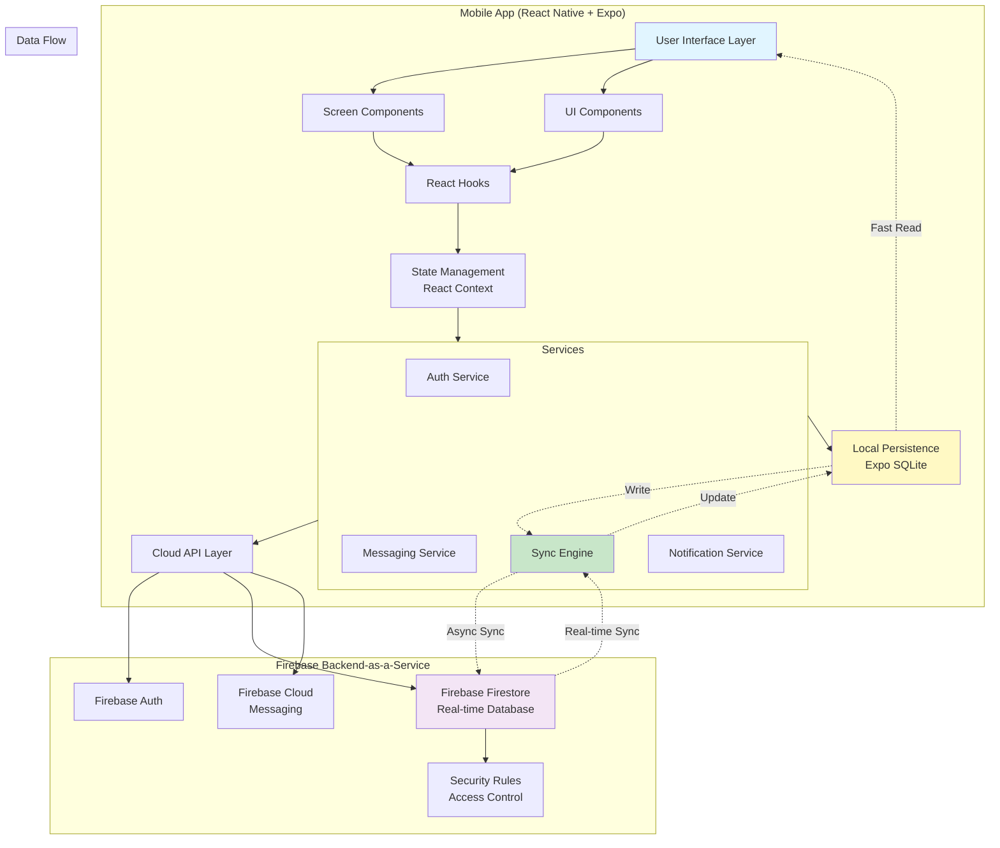
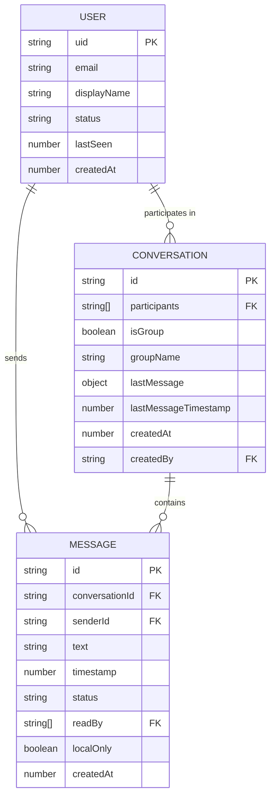
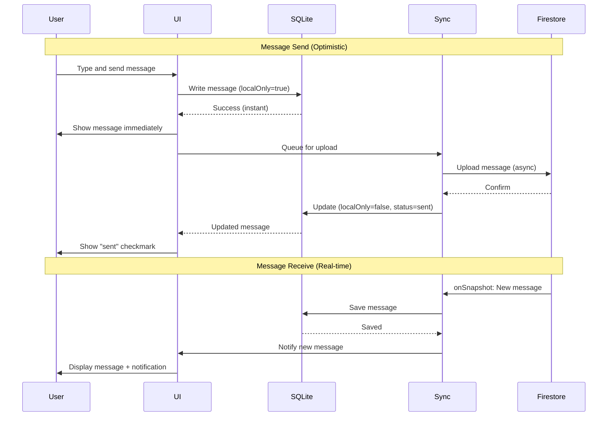

# Comm Fullstack Architecture Document

## Introduction

This document outlines the complete fullstack architecture for **Comm**, a cross-platform messaging application built with React Native and Firebase. It serves as the single source of truth for AI-driven development, ensuring consistency across the mobile frontend, backend-as-a-service (Firebase), and their integration.

This architecture is designed to prove that production-quality messaging infrastructure can be built with solid real-time sync, offline support, and optimistic UI updates. Every architectural decision prioritizes **message reliability, perceived speed, and offline resilience**.

### Starter Template or Existing Project

**N/A - Greenfield project**

We are building from scratch using Expo's managed workflow with TypeScript. No starter template is being used to ensure complete control over the messaging infrastructure architecture.

### Change Log

| Date | Version | Description | Author |
|------|---------|-------------|--------|
| 2025-10-22 | 1.0 | Initial architecture document | Winston (Architect) |

---

## High Level Architecture

### Technical Summary

Comm uses a **mobile-first, offline-first architecture** with React Native + Expo for the frontend and Firebase as the backend-as-a-service. The architecture employs a **dual-persistence strategy**: local-first storage with Expo SQLite for instant UI rendering and offline capability, synchronized with Firebase Firestore for cloud persistence and real-time multi-device sync. 

Messages are written optimistically to the local database first, displayed immediately to the user, then asynchronously synced to Firestore. Real-time listeners keep all online clients in sync within 300ms. Firebase Authentication handles user management, while Firebase Cloud Messaging (via Expo Notifications) enables foreground push notifications.

This architecture achieves the PRD's goals by prioritizing **local-first data access** (instant UI), **optimistic updates** (perceived speed), **Firestore real-time listeners** (sub-300ms delivery), and **automatic sync recovery** (offline resilience). The clean separation between services (auth, messaging, sync, storage) enables rapid feature development post-MVP.

### Platform and Infrastructure Choice

**Platform:** Firebase (Google Cloud Platform)  
**Key Services:**
- **Firebase Firestore** - Real-time NoSQL database for message storage and sync
- **Firebase Authentication** - User authentication and account management
- **Firebase Cloud Messaging (FCM)** - Push notification infrastructure (Expo Notifications client)
- **Firebase Hosting** - (Future) Web dashboard if needed
- **Firebase Security Rules** - Data access control and authorization

**Deployment Host:** Mobile app runs via **Expo Go** (development mode only for MVP)  
**Future Deployment:** Expo EAS (post-MVP) for standalone builds  
**Regions:** Firebase multi-region (automatic) with primary focus on North America

**Rationale:**
- **Firebase free tier** sufficient for MVP testing
- **Firestore real-time capabilities** perfect for messaging (built-in offline persistence, real-time listeners)
- **Expo + Firebase integration** well-documented and mature
- **No custom backend** needed - reduces complexity, maintenance, and cost
- **Scales automatically** when moving beyond MVP

### Repository Structure

**Structure:** Monorepo (single repository for mobile app)

**Monorepo Tool:** N/A (not needed for single app, using standard Expo project structure)

**Package Organization:**
```
comm/
├── app/                    # Expo Router screens (file-based routing)
│   ├── (auth)/            # Auth flow screens (login, register)
│   ├── (tabs)/            # Main app tabs (conversations, settings)
│   └── chat/[id].tsx      # Dynamic chat screen
├── components/             # Reusable React components
│   ├── ui/                # Basic UI components (Button, Input, etc.)
│   └── chat/              # Chat-specific components (Message, MessageList)
├── services/              # Business logic and external service integrations
│   ├── firebase/          # Firebase service layer
│   ├── sqlite/            # SQLite service layer
│   ├── sync/              # Sync engine between Firebase and SQLite
│   └── notifications/     # Push notification handling
├── hooks/                 # Custom React hooks
├── store/                 # Global state management (React Context)
├── types/                 # TypeScript type definitions
├── utils/                 # Helper functions and utilities
├── constants/             # App constants (colors, config, etc.)
├── assets/                # Static assets (images, fonts)
└── docs/                  # Project documentation
```

### High Level Architecture Diagram



### Architectural Patterns

- **Offline-First Architecture:** Local SQLite database is the source of truth for UI rendering. All data reads come from local storage first, ensuring instant load times and offline capability. Cloud sync happens asynchronously in the background. - _Rationale:_ Critical for perceived speed and offline resilience in a messaging app.

- **Optimistic UI Updates:** UI updates immediately upon user action (send message), before server confirmation. Local state updated first, then synced to cloud. Failures handled gracefully with retry mechanisms. - _Rationale:_ Creates perception of instant messaging, essential for user experience in real-time communication.

- **Dual-Persistence Strategy:** All messages stored in both local SQLite (for offline access and fast reads) and Firestore (for cloud backup and cross-device sync). Sync engine maintains consistency between the two. - _Rationale:_ Balances speed (local) with reliability (cloud) and enables multi-device messaging.

- **Service-Oriented Architecture (Frontend):** Clean separation of concerns with distinct service layers (Auth, Messaging, Sync, Notifications). Services encapsulate business logic and external integrations. - _Rationale:_ Maintainability, testability, and clear boundaries for AI agent implementation.

- **Real-Time Event-Driven Sync:** Firestore real-time listeners (onSnapshot) detect changes immediately and push updates to clients. No polling required. - _Rationale:_ Achieves sub-300ms message delivery latency for online users.

- **Component-Based UI:** Reusable React components with clear props interfaces. Separation between "smart" containers (hooks, state) and "dumb" presentational components. - _Rationale:_ Enables rapid UI development and consistent design patterns.

- **Repository Pattern:** Data access abstracted behind service interfaces. Components never directly access SQLite or Firestore - always through service layer. - _Rationale:_ Enables easy testing, swapping data sources, and maintaining single responsibility principle.

- **Security-First Design:** Firebase Security Rules enforce server-side authorization. All API requests require authentication. Sensitive data never stored in plain text. - _Rationale:_ Defense in depth - client-side security checks backed by server-side enforcement.

---

## Tech Stack

### Technology Stack Table

| Category | Technology | Version | Purpose | Rationale |
|----------|-----------|---------|---------|-----------|
| **Frontend Language** | TypeScript | 5.x | Type-safe mobile app development | Type safety critical for messaging logic; prevents runtime errors in sync and offline scenarios |
| **Frontend Framework** | React Native | 0.73.x | Cross-platform mobile development | Expo requires specific RN version; proven platform for production messaging apps |
| **Mobile SDK** | Expo SDK | 50.x | Managed React Native workflow | Simplifies native module integration (SQLite, Notifications); no custom native code needed |
| **Navigation** | Expo Router | 3.x | File-based routing for mobile | Modern routing approach; deep linking support for notifications |
| **UI Component Library** | React Native Elements | 4.x | Pre-built mobile UI components | Speeds up UI development with consistent, accessible components |
| **State Management** | React Context + Hooks | Built-in | Global state management | Simple, sufficient for MVP scope; no over-engineering with Redux/Zustand |
| **Backend Platform** | Firebase | Latest | Backend-as-a-Service | No custom backend needed; free tier sufficient; real-time capabilities built-in |
| **Backend Database** | Firebase Firestore | Latest | Real-time NoSQL cloud database | Real-time listeners for instant sync; offline persistence; scales automatically |
| **Local Database** | Expo SQLite | Latest (expo-sqlite) | Local relational database | Fast local queries; reliable offline storage; battle-tested in production apps |
| **Authentication** | Firebase Authentication | Latest | User account management | Drop-in auth solution; secure; integrates with Firestore security rules |
| **Push Notifications** | Expo Notifications | Latest | Foreground push notifications | Expo-managed FCM integration; no custom native code |
| **API Style** | Firebase SDK (JavaScript) | 9.x | Firebase client library | Official SDK; tree-shakeable; TypeScript support |
| **Frontend Testing** | Jest + React Native Testing Library | Latest | Unit and component testing | Standard React Native testing stack |
| **E2E Testing** | Manual (MVP) | N/A | Manual testing on real devices | E2E automation deferred post-MVP; focus on manual multi-user testing |
| **Build Tool** | Expo CLI | Latest | Expo project management | Required for Expo managed workflow, no EAS for MVP |
| **Bundler** | Metro | Latest | React Native bundler | Standard RN bundler; optimized for mobile |
| **CI/CD** | None (MVP) | N/A | Manual testing and deployment | CI/CD and EAS deferred post-MVP |
| **Monitoring** | Firebase Crashlytics (future) | Latest | Crash reporting | Post-MVP; manual testing sufficient for MVP |
| **Logging** | Console + Firebase (future) | N/A | Development logging | Console logging for MVP; structured logging post-MVP |
| **Styling** | StyleSheet (React Native) | Built-in | Component styling | Native RN styling; simple and performant |
| **Date/Time** | date-fns | 2.x | Date formatting and manipulation | Lightweight; tree-shakeable; better than moment.js |
| **Network Detection** | @react-native-community/netinfo | 11.x | Network status monitoring | Detects online/offline state for sync logic |
| **Unique IDs** | uuid | 9.x | Generate unique message IDs | Client-side ID generation for optimistic updates |

---

## Data Models

### User Model

**Purpose:** Represents a user account with authentication and profile information.

**Key Attributes:**
- `uid`: string - Firebase Authentication unique user ID (primary key)
- `email`: string - User's email address (from Firebase Auth)
- `displayName`: string - User's chosen display name (3-30 characters)
- `status`: enum - User's online/offline status ('online', 'offline')
- `lastSeen`: timestamp - Last time user was active (for presence)
- `createdAt`: timestamp - Account creation timestamp

#### TypeScript Interface

```typescript
interface User {
  uid: string;              // Firebase Auth UID
  email: string;            // User email
  displayName: string;      // Display name (shown to other users)
  status: 'online' | 'offline'; // Online/offline status
  lastSeen: number;         // Unix timestamp (milliseconds)
  createdAt: number;        // Unix timestamp (milliseconds)
}
```

#### Relationships
- User has many Conversations (through participants array)
- User has many Messages (as sender)

---

### Conversation Model

**Purpose:** Represents a one-on-one or group conversation between users.

**Key Attributes:**
- `id`: string - Unique conversation ID (UUID)
- `participants`: string[] - Array of user UIDs participating in conversation
- `isGroup`: boolean - True if 3+ participants (group chat)
- `groupName`: string | null - Optional group name (null for one-on-one)
- `lastMessage`: object | null - Preview of most recent message
- `lastMessageTimestamp`: number - Timestamp of last message (for sorting)
- `createdAt`: number - Conversation creation timestamp
- `createdBy`: string - UID of user who created conversation

#### TypeScript Interface

```typescript
interface Conversation {
  id: string;               // Unique conversation ID
  participants: string[];   // Array of user UIDs
  isGroup: boolean;         // True if group chat (3+ participants)
  groupName?: string | null; // Optional group name
  lastMessage?: {           // Most recent message preview
    text: string;
    senderId: string;
    timestamp: number;
  } | null;
  lastMessageTimestamp: number; // For sorting conversations
  createdAt: number;        // Unix timestamp (milliseconds)
  createdBy: string;        // UID of creator
}
```

#### Relationships
- Conversation belongs to many Users (participants)
- Conversation has many Messages (subcollection in Firestore)

---

### Message Model

**Purpose:** Represents a single text message within a conversation.

**Key Attributes:**
- `id`: string - Unique message ID (UUID, generated client-side)
- `conversationId`: string - ID of parent conversation
- `senderId`: string - UID of user who sent message
- `text`: string - Message text content
- `timestamp`: number - Server timestamp when message was created
- `status`: enum - Delivery status ('sending', 'sent', 'delivered', 'read', 'failed')
- `readBy`: string[] - Array of user UIDs who have read this message
- `localOnly`: boolean - True if message not yet synced to Firestore
- `createdAt`: number - Client-side timestamp when message was created locally

#### TypeScript Interface

```typescript
interface Message {
  id: string;               // Unique message ID (UUID)
  conversationId: string;   // Parent conversation ID
  senderId: string;         // Sender's UID
  text: string;             // Message content
  timestamp: number;        // Server timestamp (milliseconds)
  status: MessageStatus;    // Delivery status
  readBy: string[];         // UIDs of users who read message
  localOnly: boolean;       // True if not synced to Firestore yet
  createdAt: number;        // Client timestamp (milliseconds)
}

type MessageStatus = 'sending' | 'sent' | 'delivered' | 'read' | 'failed';
```

#### Relationships
- Message belongs to one Conversation
- Message belongs to one User (sender)
- Message tracked by multiple Users (readBy)

---

### Data Model Relationships Diagram



---

## Database Schemas

### Firestore Schema

**Collection Structure:**

```
/users/{uid}
  - email: string
  - displayName: string
  - status: 'online' | 'offline'
  - lastSeen: timestamp
  - createdAt: timestamp

/conversations/{conversationId}
  - participants: string[]
  - isGroup: boolean
  - groupName: string | null
  - lastMessage: {
      text: string,
      senderId: string,
      timestamp: timestamp
    } | null
  - lastMessageTimestamp: timestamp
  - createdAt: timestamp
  - createdBy: string

  /messages/{messageId} (subcollection)
    - senderId: string
    - text: string
    - timestamp: timestamp (server)
    - status: string
    - readBy: string[]
    - createdAt: timestamp
```

**Indexes (Firestore automatic):**
- `conversations` collection: Index on `participants` (array-contains)
- `conversations` collection: Composite index on `participants` + `lastMessageTimestamp` (desc)
- `messages` subcollection: Index on `timestamp` (asc)

**Security Rules:** See Security section below.

---

### SQLite Schema

**Tables:**

```sql
CREATE TABLE users (
  uid TEXT PRIMARY KEY,
  email TEXT NOT NULL,
  displayName TEXT NOT NULL,
  status TEXT NOT NULL DEFAULT 'offline',
  lastSeen INTEGER,
  createdAt INTEGER NOT NULL
);

CREATE TABLE conversations (
  id TEXT PRIMARY KEY,
  participants TEXT NOT NULL,        -- JSON string array of UIDs
  isGroup INTEGER NOT NULL DEFAULT 0, -- Boolean: 0=false, 1=true
  groupName TEXT,
  lastMessageText TEXT,
  lastMessageSenderId TEXT,
  lastMessageTimestamp INTEGER,
  createdAt INTEGER NOT NULL,
  createdBy TEXT NOT NULL
);

CREATE TABLE messages (
  id TEXT PRIMARY KEY,
  conversationId TEXT NOT NULL,
  senderId TEXT NOT NULL,
  text TEXT NOT NULL,
  timestamp INTEGER NOT NULL,
  status TEXT NOT NULL,               -- 'sending', 'sent', 'delivered', 'read', 'failed'
  readBy TEXT NOT NULL DEFAULT '[]',  -- JSON string array of UIDs
  localOnly INTEGER NOT NULL DEFAULT 0, -- Boolean: 0=false, 1=true
  createdAt INTEGER NOT NULL,
  FOREIGN KEY (conversationId) REFERENCES conversations(id)
);

-- Indexes for performance
CREATE INDEX idx_messages_conversation ON messages(conversationId, timestamp);
CREATE INDEX idx_messages_local ON messages(localOnly, status);
CREATE INDEX idx_conversations_timestamp ON conversations(lastMessageTimestamp DESC);
```

**Notes:**
- Arrays stored as JSON strings (SQLite limitation)
- Boolean values stored as INTEGER (0/1)
- Timestamps stored as INTEGER (Unix milliseconds)
- Foreign keys defined but not enforced (for flexibility)

---

## API Specification

**API Style:** Firebase SDK (JavaScript Client Library) - No custom REST API

Since we're using Firebase as Backend-as-a-Service, there is no custom REST API. All backend interactions happen through the Firebase JavaScript SDK:

### Firebase SDK Operations

**Authentication:**
```typescript
// Sign up
createUserWithEmailAndPassword(auth, email, password);

// Sign in
signInWithEmailAndPassword(auth, email, password);

// Sign out
signOut(auth);

// Auth state listener
onAuthStateChanged(auth, (user) => { ... });
```

**Firestore Operations:**
```typescript
// Create user profile
setDoc(doc(firestore, 'users', uid), userData);

// Create conversation
addDoc(collection(firestore, 'conversations'), conversationData);

// Send message
addDoc(collection(firestore, `conversations/${conversationId}/messages`), messageData);

// Real-time listeners
onSnapshot(collection(firestore, 'conversations'), (snapshot) => { ... });
onSnapshot(collection(firestore, `conversations/${conversationId}/messages`), (snapshot) => { ... });

// Query conversations
query(collection(firestore, 'conversations'), 
  where('participants', 'array-contains', currentUserUid),
  orderBy('lastMessageTimestamp', 'desc')
);
```

**Local SQLite Operations:**
```typescript
// Service layer abstracts SQL queries
sqliteService.saveMessage(message);
sqliteService.getMessages(conversationId);
sqliteService.updateMessageStatus(messageId, status);
```

All API access is authenticated via Firebase Auth tokens (handled automatically by Firebase SDK).

---

## Components

### Authentication Service

**Responsibility:** Provides basic authentication to identify users and control access to the app. Minimal complexity - just sign in/out functionality.

**Key Interfaces:**
- `signIn(email: string, password: string): Promise<User>` - Authenticate user
- `signUp(email: string, password: string, displayName: string): Promise<User>` - Create new account (simple, single-screen)
- `signOut(): Promise<void>` - Sign out current user
- `getCurrentUser(): User | null` - Get currently authenticated user
- `onAuthStateChange(callback: (user: User | null) => void): Unsubscribe` - Listen for auth state changes

**Dependencies:**
- Firebase Authentication SDK (email/password only)
- Firestore (minimal - just store displayName)

**Technology Stack:** 
- Firebase Auth (email/password provider only)
- React Context for auth state
- Simple conditional rendering for auth gates

**Implementation Notes:**
- **Keep it simple:** No password reset, email verification, or social auth in MVP
- **Combined auth screen:** Single screen with "Sign In" / "Sign Up" toggle
- **Minimal validation:** Just check email format and password length (6+ chars)
- **Auto-login:** Remember user session across app restarts (Firebase handles this)
- **Basic error messages:** "Invalid credentials" or "Email already in use"

---

### Messaging Service

**Responsibility:** Core messaging operations - sending, receiving, and managing messages and conversations.

**Key Interfaces:**
- `sendMessage(conversationId: string, text: string): Promise<Message>` - Send new message (optimistic)
- `getMessages(conversationId: string, limit?: number): Promise<Message[]>` - Get messages for conversation
- `markMessagesAsRead(conversationId: string, messageIds: string[]): Promise<void>` - Update read status
- `createConversation(participantUids: string[], groupName?: string): Promise<Conversation>` - Create new conversation
- `getConversations(): Promise<Conversation[]>` - Get all user conversations
- `subscribeToConversation(conversationId: string, callback: (message: Message) => void): Unsubscribe` - Real-time message listener

**Dependencies:**
- SQLite Service (local storage)
- Sync Engine (cloud sync)
- Auth Service (current user UID)

**Technology Stack:** 
- Firestore for cloud message storage
- SQLite for local message storage
- Custom hooks for component integration

---

### Sync Engine

**Responsibility:** Synchronizes data between local SQLite and cloud Firestore, handles offline queueing, and manages conflict resolution.

**Key Interfaces:**
- `syncConversations(): Promise<void>` - Sync all conversations from Firestore to SQLite
- `syncMessages(conversationId: string): Promise<void>` - Sync messages for specific conversation
- `uploadPendingMessages(): Promise<void>` - Upload unsent messages from local queue to Firestore
- `handleIncomingMessage(message: Message): Promise<void>` - Process real-time message from Firestore
- `startRealtimeSync(): void` - Initialize real-time Firestore listeners
- `stopRealtimeSync(): void` - Clean up Firestore listeners

**Dependencies:**
- SQLite Service (local data access)
- Firestore (cloud data access)
- Network Detection (online/offline state)

**Technology Stack:** 
- Firestore real-time listeners (onSnapshot)
- NetInfo for network detection
- Custom sync logic with retry mechanisms

**Sync Strategy:**
1. **On app launch:** Load from SQLite first (instant UI), then sync from Firestore in background
2. **On message send:** Write to SQLite immediately, upload to Firestore async
3. **On Firestore change:** Update SQLite, trigger UI re-render
4. **On reconnect:** Upload queued local messages, fetch missed remote messages

---

### SQLite Service

**Responsibility:** Abstracts all local database operations for users, conversations, and messages.

**Key Interfaces:**
- `initializeDatabase(): Promise<void>` - Create tables and indexes
- `saveUser(user: User): Promise<void>` - Insert or update user
- `saveConversation(conversation: Conversation): Promise<void>` - Insert or update conversation
- `saveMessage(message: Message): Promise<void>` - Insert or update message
- `getMessages(conversationId: string, limit?: number): Promise<Message[]>` - Query messages
- `getConversations(userId: string): Promise<Conversation[]>` - Query conversations
- `updateMessageStatus(messageId: string, status: MessageStatus): Promise<void>` - Update message status
- `getUnsyncedMessages(): Promise<Message[]>` - Get messages with localOnly=true

**Dependencies:**
- Expo SQLite

**Technology Stack:** 
- expo-sqlite for database access
- Prepared statements for performance
- Transactions for atomicity

---

### Notification Service

**Responsibility:** Manages push notifications for new messages when app is in foreground.

**Key Interfaces:**
- `requestPermissions(): Promise<boolean>` - Request notification permissions from user
- `showMessageNotification(message: Message, conversationName: string): Promise<void>` - Display local notification
- `handleNotificationTap(data: NotificationData): void` - Navigate to conversation when notification tapped
- `cancelNotification(notificationId: string): Promise<void>` - Cancel notification

**Dependencies:**
- Expo Notifications
- Navigation (for deep linking)

**Technology Stack:** 
- Expo Notifications API
- Local notifications (no FCM server needed for MVP foreground)
- Notification categories and actions

---

### Presence Service

**Responsibility:** Tracks and displays user online/offline status in real-time.

**Key Interfaces:**
- `updatePresence(status: 'online' | 'offline'): Promise<void>` - Update current user status in Firestore
- `subscribeToUserPresence(uid: string, callback: (status: string) => void): Unsubscribe` - Listen to another user's presence
- `startPresenceTracking(): void` - Begin automatic presence updates based on app state
- `stopPresenceTracking(): void` - Stop presence tracking

**Dependencies:**
- Firestore (user status updates)
- AppState API (detect foreground/background)
- NetInfo (detect network status)

**Technology Stack:** 
- Firestore real-time updates
- React Native AppState
- Periodic heartbeat (every 30 seconds when online)

---

## Frontend Architecture

### Project Folder Structure

```
comm/
├── app/                           # Expo Router file-based routing
│   ├── _layout.tsx               # Root layout with auth check
│   ├── (auth)/                   # Auth flow group
│   │   ├── _layout.tsx          # Auth layout
│   │   └── index.tsx            # Single auth screen (sign in/sign up toggle)
│   ├── (tabs)/                   # Main app tabs group
│   │   ├── _layout.tsx          # Tab layout
│   │   ├── index.tsx            # Conversations list (home)
│   │   └── settings.tsx         # Settings screen
│   ├── chat/[id].tsx            # Dynamic chat screen
│   ├── new-conversation.tsx     # User selection screen
│   └── new-group.tsx            # Group creation screen
│
├── components/                    # Reusable components
│   ├── ui/                       # Basic UI components
│   │   ├── Button.tsx
│   │   ├── Input.tsx
│   │   ├── Avatar.tsx
│   │   └── LoadingSpinner.tsx
│   ├── chat/                     # Chat-specific components
│   │   ├── Message.tsx          # Single message component
│   │   ├── MessageList.tsx      # Message list with FlatList
│   │   ├── MessageInput.tsx     # Message composition
│   │   └── TypingIndicator.tsx  # (Post-MVP)
│   ├── conversation/             # Conversation components
│   │   ├── ConversationItem.tsx # Conversation list item
│   │   └── ConversationList.tsx # Conversation list
│   └── ConnectionBanner.tsx      # Offline/reconnecting banner
│
├── services/                     # Business logic services
│   ├── auth/
│   │   └── authService.ts       # Authentication service
│   ├── messaging/
│   │   └── messagingService.ts  # Messaging operations
│   ├── sync/
│   │   └── syncEngine.ts        # Sync between SQLite and Firestore
│   ├── sqlite/
│   │   └── sqliteService.ts     # Local database operations
│   ├── notifications/
│   │   └── notificationService.ts # Push notification handling
│   ├── presence/
│   │   └── presenceService.ts   # Online/offline status
│   └── firebase/
│       └── firebaseConfig.ts    # Firebase initialization
│
├── hooks/                        # Custom React hooks
│   ├── useAuth.ts               # Auth state and operations
│   ├── useConversations.ts      # Conversation list with real-time updates
│   ├── useMessages.ts           # Messages for specific conversation
│   ├── usePresence.ts           # User presence status
│   ├── useNetworkStatus.ts      # Network online/offline detection
│   └── useKeyboard.ts           # Keyboard state management
│
├── store/                        # Global state management
│   ├── AuthContext.tsx          # Auth state provider
│   ├── MessagingContext.tsx     # Messaging state provider
│   └── NetworkContext.tsx       # Network status provider
│
├── types/                        # TypeScript definitions
│   ├── models.ts                # Data model interfaces (User, Message, Conversation)
│   ├── services.ts              # Service interface types
│   └── navigation.ts            # Navigation type definitions
│
├── utils/                        # Utility functions
│   ├── dateFormatters.ts        # Date/time formatting (using date-fns)
│   ├── validation.ts            # Input validation helpers
│   ├── uuidGenerator.ts         # UUID generation for message IDs
│   └── errorHandlers.ts         # Error handling utilities
│
├── constants/                    # App constants
│   ├── Colors.ts                # Color palette
│   ├── Config.ts                # App configuration
│   └── Layout.ts                # Layout constants (spacing, etc.)
│
├── assets/                       # Static assets
│   ├── images/
│   └── fonts/
│
├── docs/                         # Project documentation
│   ├── project-brief.md
│   ├── prd.md
│   └── architecture.md (this file)
│
├── .env                          # Environment variables (Firebase config)
├── .gitignore
├── app.json                      # Expo configuration
├── package.json
├── tsconfig.json
└── README.md
```

---

## State Management Strategy

### Approach: React Context + Hooks (No Redux/Zustand for MVP)

**Rationale:**
- MVP scope doesn't warrant heavy state management library
- React Context sufficient for auth, network status, and messaging state
- Reduces bundle size and complexity
- Hooks provide clean, functional API for components

### Context Providers

**AuthContext:**
```typescript
interface AuthContextType {
  user: User | null;
  isLoading: boolean;
  signIn: (email: string, password: string) => Promise<void>;
  signUp: (email: string, password: string, displayName: string) => Promise<void>;
  signOut: () => Promise<void>;
}
```

**NetworkContext:**
```typescript
interface NetworkContextType {
  isOnline: boolean;
  isReconnecting: boolean;
}
```

**MessagingContext (optional, may be hook-only):**
```typescript
interface MessagingContextType {
  conversations: Conversation[];
  unreadCount: number;
  refreshConversations: () => Promise<void>;
}
```

Components access state via hooks:
```typescript
const { user, signOut } = useAuth();
const { isOnline } = useNetworkStatus();
const { conversations, messages } = useMessages(conversationId);
```

---

## Real-Time Sync Architecture

### Sync Flow



### Offline Queueing

**Strategy:**
1. User sends message while offline
2. Message saved to SQLite with `localOnly=true`, `status='sending'`
3. UI displays message immediately
4. Network detection (NetInfo) detects reconnection
5. Sync Engine queries SQLite for messages where `localOnly=true`
6. Messages uploaded to Firestore sequentially
7. On success: Update `localOnly=false`, `status='sent'`
8. On failure: Update `status='failed'`, show retry button

**Retry Logic:**
- Exponential backoff: 1s, 2s, 4s, 8s, 16s (max)
- After 5 failed attempts, mark as 'failed' and require manual retry

---

## Security Implementation

### Firebase Security Rules

```javascript
rules_version = '2';
service cloud.firestore {
  match /databases/{database}/documents {
    
    // Helper functions
    function isAuthenticated() {
      return request.auth != null;
    }
    
    function isUser(uid) {
      return isAuthenticated() && request.auth.uid == uid;
    }
    
    // Users collection
    match /users/{uid} {
      // Anyone can read user profiles (for display names)
      allow read: if isAuthenticated();
      
      // Users can only create/update their own profile
      allow create, update: if isUser(uid);
      
      // No one can delete users
      allow delete: if false;
    }
    
    // Conversations collection
    match /conversations/{conversationId} {
      // Users can read conversations they participate in
      allow read: if isAuthenticated() && 
                     request.auth.uid in resource.data.participants;
      
      // Users can create new conversations
      allow create: if isAuthenticated() &&
                       request.auth.uid in request.resource.data.participants;
      
      // Users can update conversations they participate in
      allow update: if isAuthenticated() &&
                       request.auth.uid in resource.data.participants;
      
      // No one can delete conversations (MVP - can add later)
      allow delete: if false;
      
      // Messages subcollection
      match /messages/{messageId} {
        // Users can read messages in conversations they participate in
        allow read: if isAuthenticated() &&
                       request.auth.uid in get(/databases/$(database)/documents/conversations/$(conversationId)).data.participants;
        
        // Users can create messages in conversations they participate in
        allow create: if isAuthenticated() &&
                         request.auth.uid in get(/databases/$(database)/documents/conversations/$(conversationId)).data.participants &&
                         request.auth.uid == request.resource.data.senderId;
        
        // Users can update messages (for read receipts)
        allow update: if isAuthenticated() &&
                         request.auth.uid in get(/databases/$(database)/documents/conversations/$(conversationId)).data.participants;
        
        // No one can delete messages (MVP)
        allow delete: if false;
      }
    }
  }
}
```

### Client-Side Security

- **API Keys in Environment Variables:** Firebase config stored in `.env`, loaded via `expo-constants`, never committed to git
- **Auth Token Management:** Firebase SDK handles token refresh automatically
- **Input Validation:** All user inputs sanitized before storage
- **SQL Injection Prevention:** Using parameterized queries in SQLite
- **No Sensitive Data in SQLite:** Passwords never stored locally (handled by Firebase Auth)

---

## Performance Optimization Strategies

### 1. FlatList Virtualization

```typescript
<FlatList
  data={messages}
  renderItem={({ item }) => <Message message={item} />}
  keyExtractor={(item) => item.id}
  initialNumToRender={50}        // Load 50 messages initially
  maxToRenderPerBatch={10}       // Render 10 at a time on scroll
  windowSize={21}                // Keep 21 screens worth in memory
  getItemLayout={(data, index) => ({
    length: ITEM_HEIGHT,         // Fixed height for performance
    offset: ITEM_HEIGHT * index,
    index,
  })}
  inverted                       // Chat-style reverse scrolling
  onEndReached={loadMoreMessages} // Pagination
  onEndReachedThreshold={0.5}
/>
```

### 2. Message Pagination

- Initial load: 50 most recent messages
- Load more: 25 messages at a time on scroll up
- SQLite query: `LIMIT 50 OFFSET 0` → `LIMIT 25 OFFSET 50`, etc.
- Stop loading when no more messages available

### 3. Firestore Query Optimization

```typescript
// Efficient conversation query with composite index
const conversationsQuery = query(
  collection(firestore, 'conversations'),
  where('participants', 'array-contains', currentUserUid),
  orderBy('lastMessageTimestamp', 'desc'),
  limit(20) // Only fetch most recent 20 conversations
);

// Efficient message query
const messagesQuery = query(
  collection(firestore, `conversations/${conversationId}/messages`),
  orderBy('timestamp', 'desc'),
  limit(50)
);
```

### 4. Component Memoization

```typescript
// Prevent unnecessary re-renders
const Message = React.memo(({ message }) => {
  // Component implementation
}, (prevProps, nextProps) => {
  return prevProps.message.id === nextProps.message.id &&
         prevProps.message.status === nextProps.message.status;
});
```

### 5. Debouncing Presence Updates

```typescript
// Update presence every 30 seconds (not on every action)
const updatePresence = debounce(() => {
  presenceService.updatePresence('online');
}, 30000);
```

### 6. SQLite Indexes

- Index on `(conversationId, timestamp)` for message queries
- Index on `lastMessageTimestamp` for conversation sorting
- Index on `(localOnly, status)` for queued message queries

### 7. Image Loading (Post-MVP)

- Lazy load images with placeholder
- Image compression before upload
- CDN caching via Firebase Storage

---

## Error Handling & Retry Logic

### Error Categories

1. **Network Errors:** Temporary connectivity issues
   - **Strategy:** Retry with exponential backoff
   - **User Feedback:** "Connection lost. Retrying..."

2. **Firestore Errors:** Permission denied, quota exceeded
   - **Strategy:** Log error, show user-friendly message
   - **User Feedback:** "Unable to send message. Please try again."

3. **SQLite Errors:** Database corruption, disk full
   - **Strategy:** Attempt recovery, fallback to Firestore-only mode
   - **User Feedback:** "Local storage error. Some features may be limited."

4. **Auth Errors:** Invalid credentials, token expired
   - **Strategy:** Force re-authentication
   - **User Feedback:** "Session expired. Please log in again."

### Retry Logic Implementation

```typescript
async function retryWithBackoff<T>(
  operation: () => Promise<T>,
  maxRetries: number = 5
): Promise<T> {
  let lastError: Error;
  
  for (let attempt = 0; attempt < maxRetries; attempt++) {
    try {
      return await operation();
    } catch (error) {
      lastError = error as Error;
      
      // Don't retry auth errors or permission errors
      if (error.code === 'permission-denied' || error.code === 'unauthenticated') {
        throw error;
      }
      
      // Exponential backoff: 1s, 2s, 4s, 8s, 16s
      const delay = Math.min(1000 * Math.pow(2, attempt), 16000);
      await new Promise(resolve => setTimeout(resolve, delay));
    }
  }
  
  throw lastError!;
}
```

---

## Testing Strategy

### Manual Testing (MVP Priority)

**Multi-User Scenarios:**
1. Two users: Send messages back and forth, measure latency
2. Offline test: User A offline, User B sends messages, User A reconnects
3. Force-quit test: Force quit app, reopen, verify message history intact
4. Group chat test: 3+ users in group, all receive messages
5. Performance test: Load conversation with 200+ messages, verify smooth scrolling

**Testing Checklist:**
- [ ] Message delivery < 300ms when online
- [ ] Optimistic updates feel instant
- [ ] Messages persist across app restarts
- [ ] Offline messages send on reconnect
- [ ] Read receipts update correctly
- [ ] Group messages delivered to all participants
- [ ] Foreground notifications appear
- [ ] Connection status indicator accurate
- [ ] App launches in < 5 seconds
- [ ] No crashes during testing session

### Unit Testing (Recommended)

**Priority areas:**
- `utils/` folder: Date formatters, validators, error handlers
- `services/sqlite/` folder: Database operations
- Message status logic
- Sync conflict resolution

**Example test:**
```typescript
describe('dateFormatters', () => {
  it('formats recent timestamp as "Just now"', () => {
    const now = Date.now();
    expect(formatTimestamp(now)).toBe('Just now');
  });
  
  it('formats timestamp from 5 minutes ago as "5m ago"', () => {
    const fiveMinutesAgo = Date.now() - (5 * 60 * 1000);
    expect(formatTimestamp(fiveMinutesAgo)).toBe('5m ago');
  });
});
```

### Integration Testing (Post-MVP)

Deferred until post-MVP. Focus on manual testing for MVP validation.

---

## Deployment Strategy

### MVP Deployment: Expo Go Only

**Process:**
1. Configure Firebase project in production mode
2. Add Firebase config to `.env` file
3. Run app locally: `npx expo start`
4. Generate QR code (automatically shown in terminal)
5. Team members scan QR code with Expo Go app
6. App loads directly from development server

**Expo Go Limitations:**
- No custom native modules (acceptable for MVP - we don't need any)
- Performance slightly lower than native build (acceptable for MVP testing)
- Requires Expo Go app installed on device
- Requires development server running (laptop must be on same network)

**Deployment Checklist:**
- [ ] Firebase project in production mode
- [ ] Security Rules deployed
- [ ] API keys in environment variables (`.env` file)
- [ ] Development server running (`npx expo start`)
- [ ] QR code visible in terminal
- [ ] Testing devices can scan and load app
- [ ] All team members on same WiFi network

**No EAS, No Publishing, No Builds for MVP:**
- NO `expo publish` - not needed
- NO EAS Update - deferred to post-MVP
- NO EAS Build - deferred to post-MVP
- NO standalone builds - use Expo Go only

### Post-MVP Deployment: Native Builds (Future)

**Future strategy (post-MVP only):**
- Use Expo EAS Build for production iOS/Android builds
- Submit to App Store / Play Store
- Implement over-the-air updates with EAS Update
- Add CI/CD pipeline (GitHub Actions + EAS)
- Create standalone apps that don't require Expo Go

---

## Monitoring & Observability (Post-MVP)

### Crash Reporting

**Tool:** Firebase Crashlytics  
**Metrics:**
- Crash-free session rate (target: > 99.5%)
- Most common crash causes
- Affected users

### Performance Monitoring

**Tool:** Firebase Performance Monitoring  
**Metrics:**
- App startup time (target: < 5s)
- Screen rendering time
- Network request latency
- Firestore query performance

### Analytics

**Tool:** Firebase Analytics  
**Events to track:**
- User registration
- Message sent
- Conversation created
- App opened
- Push notification tapped

### Logging

**MVP:** Console logging  
**Post-MVP:** Structured logging to Firebase or cloud logging service

---

## Risk Mitigation

### Risk 1: Firestore Costs

**Mitigation:**
- Monitor usage in Firebase Console dashboard
- Implement pagination (limit queries to 50 items)
- Use Firestore offline persistence to reduce redundant reads
- Debounce presence updates (every 30s, not per action)
- Set up Firebase budget alerts

### Risk 2: Sync Conflicts

**Mitigation:**
- Firestore's last-write-wins handles most conflicts
- Client-side message IDs (UUID) prevent duplicates
- Test edge cases: Two offline users, both send messages, both reconnect

### Risk 3: SQLite Performance with Large History

**Mitigation:**
- Pagination (load 50 messages at a time)
- Indexes on frequently queried columns
- Test with 10,000+ messages to validate
- Consider archiving old messages post-MVP

### Risk 4: Expo Go Limitations

**Mitigation:**
- Design around Expo constraints (no custom native modules)
- Test on iOS simulator as fallback
- Plan for native build post-MVP if needed

---

## Next Steps & Developer Handoff

This architecture document is ready for implementation. Development should proceed in the epic order defined in the PRD:

### Epic 1: Foundation & Authentication
- Set up Expo project structure
- Configure Firebase
- Implement auth screens and service
- Set up basic navigation

### Epic 2: One-on-One Messaging Core
- Implement SQLite service
- Build conversation list with Firestore sync
- Create chat screen with message display
- Implement send message with optimistic updates
- Add real-time sync engine
- Implement offline queueing
- Add read receipts and presence

### Epic 3: Group Chat
- Extend conversation model for groups
- Implement group creation flow
- Update chat screen for group display
- Add group read receipts

### Epic 4: Polish & Deployment
- Add foreground push notifications
- Optimize performance (FlatList, pagination)
- Improve keyboard handling
- Deploy to Expo Go
- Multi-user testing validation

### Key Implementation Priorities

1. **Services Layer First:** Build and test services independently before UI
2. **SQLite Before UI:** Set up local database and test queries before hooking up to React components
3. **Firebase Integration Early:** Connect Firebase Auth and Firestore in first epic to validate setup
4. **Test Offline Scenarios Frequently:** Constantly test airplane mode and force-quit scenarios
5. **Performance Benchmarks:** Measure latency and scroll performance throughout development

### Architectural Decisions to Validate During Implementation

- **State management:** If Context becomes unwieldy, consider Zustand (lightweight alternative to Redux)
- **Presence system:** Firestore-based presence vs. Firebase Realtime Database (evaluate based on accuracy needs)
- **Message pagination:** 50 initial messages sufficient? May need tuning based on UX
- **Sync frequency:** Real-time listeners vs. periodic polling for certain operations

---

## Appendix: Technology Research

### Firebase + Expo Integration

**Maturity:** Production-ready  
**Documentation:** Excellent (official Firebase docs + Expo docs)  
**Community:** Large, active community with many messaging app examples  
**Known Issues:** None blocking for MVP

### Expo SQLite

**Maturity:** Stable (used in many production apps)  
**Performance:** Adequate for 10K+ messages with proper indexing  
**Limitations:** No full-text search (can add post-MVP with separate library)  
**Alternative Considered:** WatermelonDB (more complex, unnecessary for MVP)

### Firestore for Messaging

**Pros:**
- Real-time listeners (onSnapshot) provide instant updates
- Built-in offline persistence
- Scales automatically
- Security Rules for authorization

**Cons:**
- Costs scale with usage (mitigated by free tier for MVP)
- Eventual consistency (acceptable for messaging)

**Conclusion:** Excellent choice for MVP messaging infrastructure

---

**Document Status:** Complete - Ready for Development  
**Version:** 1.0  
**Last Updated:** October 22, 2025  
**Author:** Winston (Architect)
