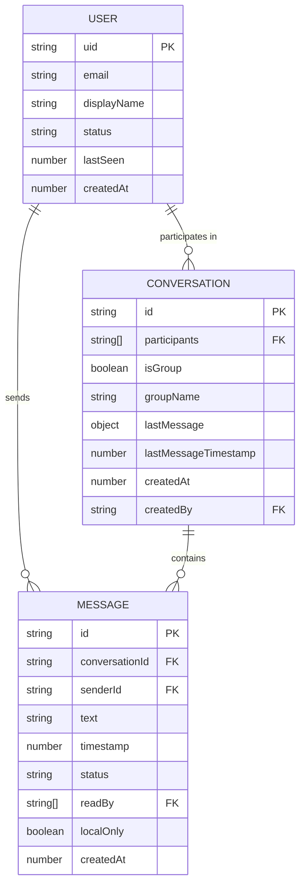

# Data Models

## User Model

**Purpose:** Represents a user account with authentication and profile information.

**Key Attributes:**
- `uid`: string - Firebase Authentication unique user ID (primary key)
- `email`: string - User's email address (from Firebase Auth)
- `displayName`: string - User's chosen display name (3-30 characters)
- `status`: enum - User's online/offline status ('online', 'offline')
- `lastSeen`: timestamp - Last time user was active (for presence)
- `createdAt`: timestamp - Account creation timestamp

### TypeScript Interface

```typescript
interface User {
  uid: string;              // Firebase Auth UID
  email: string;            // User email
  displayName: string;      // Display name (shown to other users)
  status: 'online' | 'offline'; // Online/offline status
  lastSeen: number;         // Unix timestamp (milliseconds)
  createdAt: number;        // Unix timestamp (milliseconds)
}
```

### Relationships
- User has many Conversations (through participants array)
- User has many Messages (as sender)

---

## Conversation Model

**Purpose:** Represents a one-on-one or group conversation between users.

**Key Attributes:**
- `id`: string - Unique conversation ID (UUID)
- `participants`: string[] - Array of user UIDs participating in conversation
- `isGroup`: boolean - True if 3+ participants (group chat)
- `groupName`: string | null - Optional group name (null for one-on-one)
- `lastMessage`: object | null - Preview of most recent message
- `lastMessageTimestamp`: number - Timestamp of last message (for sorting)
- `createdAt`: number - Conversation creation timestamp
- `createdBy`: string - UID of user who created conversation

### TypeScript Interface

```typescript
interface Conversation {
  id: string;               // Unique conversation ID
  participants: string[];   // Array of user UIDs
  isGroup: boolean;         // True if group chat (3+ participants)
  groupName?: string | null; // Optional group name
  lastMessage?: {           // Most recent message preview
    text: string;
    senderId: string;
    timestamp: number;
  } | null;
  lastMessageTimestamp: number; // For sorting conversations
  createdAt: number;        // Unix timestamp (milliseconds)
  createdBy: string;        // UID of creator
}
```

### Relationships
- Conversation belongs to many Users (participants)
- Conversation has many Messages (subcollection in Firestore)

---

## Message Model

**Purpose:** Represents a single text message within a conversation.

**Key Attributes:**
- `id`: string - Unique message ID (UUID, generated client-side)
- `conversationId`: string - ID of parent conversation
- `senderId`: string - UID of user who sent message
- `text`: string - Message text content
- `timestamp`: number - Server timestamp when message was created
- `status`: enum - Delivery status ('sending', 'sent', 'delivered', 'read', 'failed')
- `readBy`: string[] - Array of user UIDs who have read this message
- `localOnly`: boolean - True if message not yet synced to Firestore
- `createdAt`: number - Client-side timestamp when message was created locally

### TypeScript Interface

```typescript
interface Message {
  id: string;               // Unique message ID (UUID)
  conversationId: string;   // Parent conversation ID
  senderId: string;         // Sender's UID
  text: string;             // Message content
  timestamp: number;        // Server timestamp (milliseconds)
  status: MessageStatus;    // Delivery status
  readBy: string[];         // UIDs of users who read message
  localOnly: boolean;       // True if not synced to Firestore yet
  createdAt: number;        // Client timestamp (milliseconds)
}

type MessageStatus = 'sending' | 'sent' | 'delivered' | 'read' | 'failed';
```

### Relationships
- Message belongs to one Conversation
- Message belongs to one User (sender)
- Message tracked by multiple Users (readBy)

---

## Data Model Relationships Diagram



---
