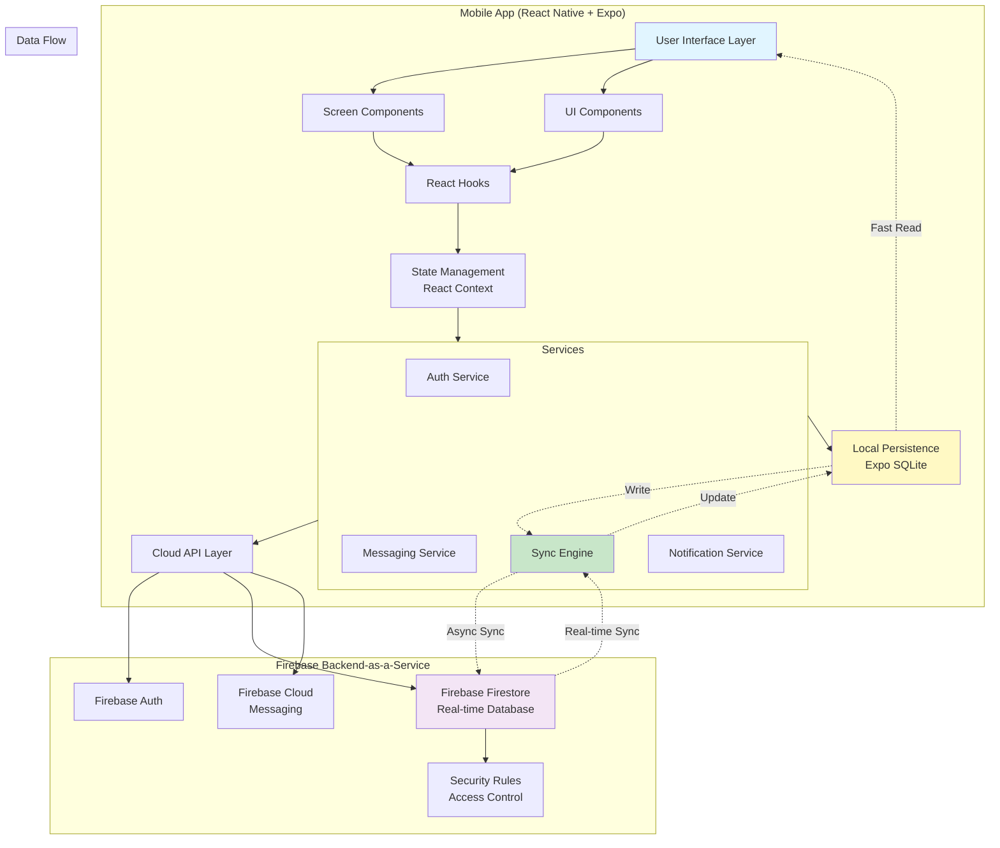

# High Level Architecture

## Technical Summary

Comm uses a **mobile-first, offline-first architecture** with React Native + Expo for the frontend and Firebase as the backend-as-a-service. The architecture employs a **dual-persistence strategy**: local-first storage with Expo SQLite for instant UI rendering and offline capability, synchronized with Firebase Firestore for cloud persistence and real-time multi-device sync. 

Messages are written optimistically to the local database first, displayed immediately to the user, then asynchronously synced to Firestore. Real-time listeners keep all online clients in sync within 300ms. Firebase Authentication handles user management, while Firebase Cloud Messaging (via Expo Notifications) enables foreground push notifications.

This architecture achieves the PRD's goals by prioritizing **local-first data access** (instant UI), **optimistic updates** (perceived speed), **Firestore real-time listeners** (sub-300ms delivery), and **automatic sync recovery** (offline resilience). The clean separation between services (auth, messaging, sync, storage) enables rapid feature development post-MVP.

## Platform and Infrastructure Choice

**Platform:** Firebase (Google Cloud Platform)  
**Key Services:**
- **Firebase Firestore** - Real-time NoSQL database for message storage and sync
- **Firebase Authentication** - User authentication and account management
- **Firebase Cloud Messaging (FCM)** - Push notification infrastructure (Expo Notifications client)
- **Firebase Hosting** - (Future) Web dashboard if needed
- **Firebase Security Rules** - Data access control and authorization

**Deployment Host:** Mobile app runs via **Expo Go** (development mode only for MVP)  
**Future Deployment:** Expo EAS (post-MVP) for standalone builds  
**Regions:** Firebase multi-region (automatic) with primary focus on North America

**Rationale:**
- **Firebase free tier** sufficient for MVP testing
- **Firestore real-time capabilities** perfect for messaging (built-in offline persistence, real-time listeners)
- **Expo + Firebase integration** well-documented and mature
- **No custom backend** needed - reduces complexity, maintenance, and cost
- **Scales automatically** when moving beyond MVP

## Repository Structure

**Structure:** Monorepo (single repository for mobile app)

**Monorepo Tool:** N/A (not needed for single app, using standard Expo project structure)

**Package Organization:**
```
comm/
├── app/                    # Expo Router screens (file-based routing)
│   ├── (auth)/            # Auth flow screens (login, register)
│   ├── (tabs)/            # Main app tabs (conversations, settings)
│   └── chat/[id].tsx      # Dynamic chat screen
├── components/             # Reusable React components
│   ├── ui/                # Basic UI components (Button, Input, etc.)
│   └── chat/              # Chat-specific components (Message, MessageList)
├── services/              # Business logic and external service integrations
│   ├── firebase/          # Firebase service layer
│   ├── sqlite/            # SQLite service layer
│   ├── sync/              # Sync engine between Firebase and SQLite
│   └── notifications/     # Push notification handling
├── hooks/                 # Custom React hooks
├── store/                 # Global state management (React Context)
├── types/                 # TypeScript type definitions
├── utils/                 # Helper functions and utilities
├── constants/             # App constants (colors, config, etc.)
├── assets/                # Static assets (images, fonts)
└── docs/                  # Project documentation
```

## High Level Architecture Diagram



## Architectural Patterns

- **Offline-First Architecture:** Local SQLite database is the source of truth for UI rendering. All data reads come from local storage first, ensuring instant load times and offline capability. Cloud sync happens asynchronously in the background. - _Rationale:_ Critical for perceived speed and offline resilience in a messaging app.

- **Optimistic UI Updates:** UI updates immediately upon user action (send message), before server confirmation. Local state updated first, then synced to cloud. Failures handled gracefully with retry mechanisms. - _Rationale:_ Creates perception of instant messaging, essential for user experience in real-time communication.

- **Dual-Persistence Strategy:** All messages stored in both local SQLite (for offline access and fast reads) and Firestore (for cloud backup and cross-device sync). Sync engine maintains consistency between the two. - _Rationale:_ Balances speed (local) with reliability (cloud) and enables multi-device messaging.

- **Service-Oriented Architecture (Frontend):** Clean separation of concerns with distinct service layers (Auth, Messaging, Sync, Notifications). Services encapsulate business logic and external integrations. - _Rationale:_ Maintainability, testability, and clear boundaries for AI agent implementation.

- **Real-Time Event-Driven Sync:** Firestore real-time listeners (onSnapshot) detect changes immediately and push updates to clients. No polling required. - _Rationale:_ Achieves sub-300ms message delivery latency for online users.

- **Component-Based UI:** Reusable React components with clear props interfaces. Separation between "smart" containers (hooks, state) and "dumb" presentational components. - _Rationale:_ Enables rapid UI development and consistent design patterns.

- **Repository Pattern:** Data access abstracted behind service interfaces. Components never directly access SQLite or Firestore - always through service layer. - _Rationale:_ Enables easy testing, swapping data sources, and maintaining single responsibility principle.

- **Security-First Design:** Firebase Security Rules enforce server-side authorization. All API requests require authentication. Sensitive data never stored in plain text. - _Rationale:_ Defense in depth - client-side security checks backed by server-side enforcement.

---
