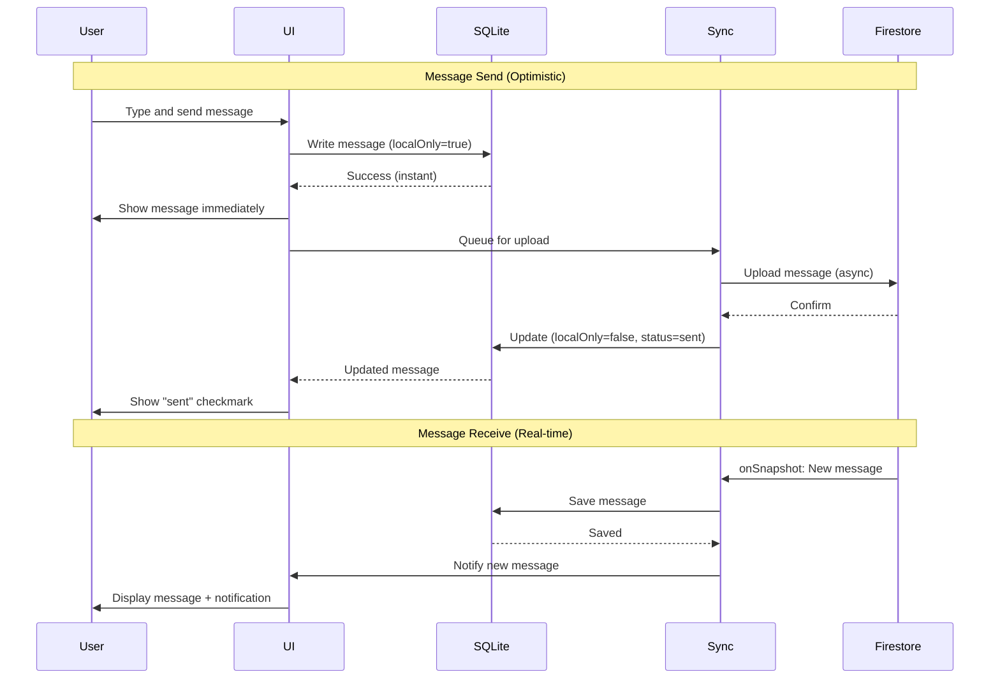

# Real-Time Sync Architecture

## Sync Flow

## Offline Queueing

**Strategy:**
1. User sends message while offline
2. Message saved to SQLite with `localOnly=true`, `status='sending'`
3. UI displays message immediately
4. Network detection (NetInfo) detects reconnection
5. Sync Engine queries SQLite for messages where `localOnly=true`
6. Messages uploaded to Firestore sequentially
7. On success: Update `localOnly=false`, `status='sent'`
8. On failure: Update `status='failed'`, show retry button

**Retry Logic:**
- Exponential backoff: 1s, 2s, 4s, 8s, 16s (max)
- After 5 failed attempts, mark as 'failed' and require manual retry

---
